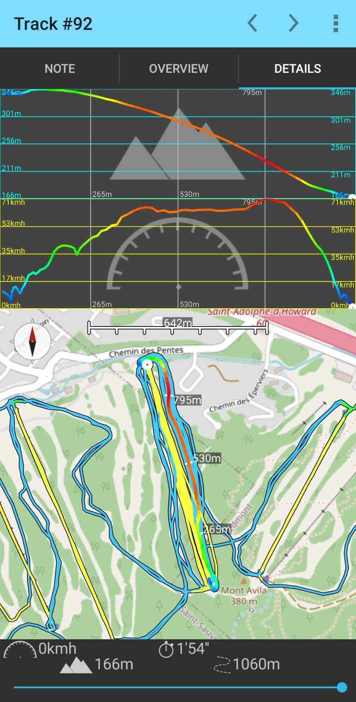
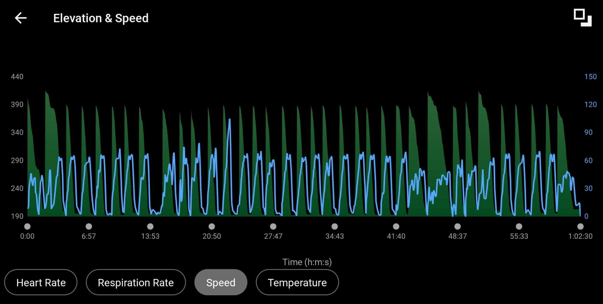
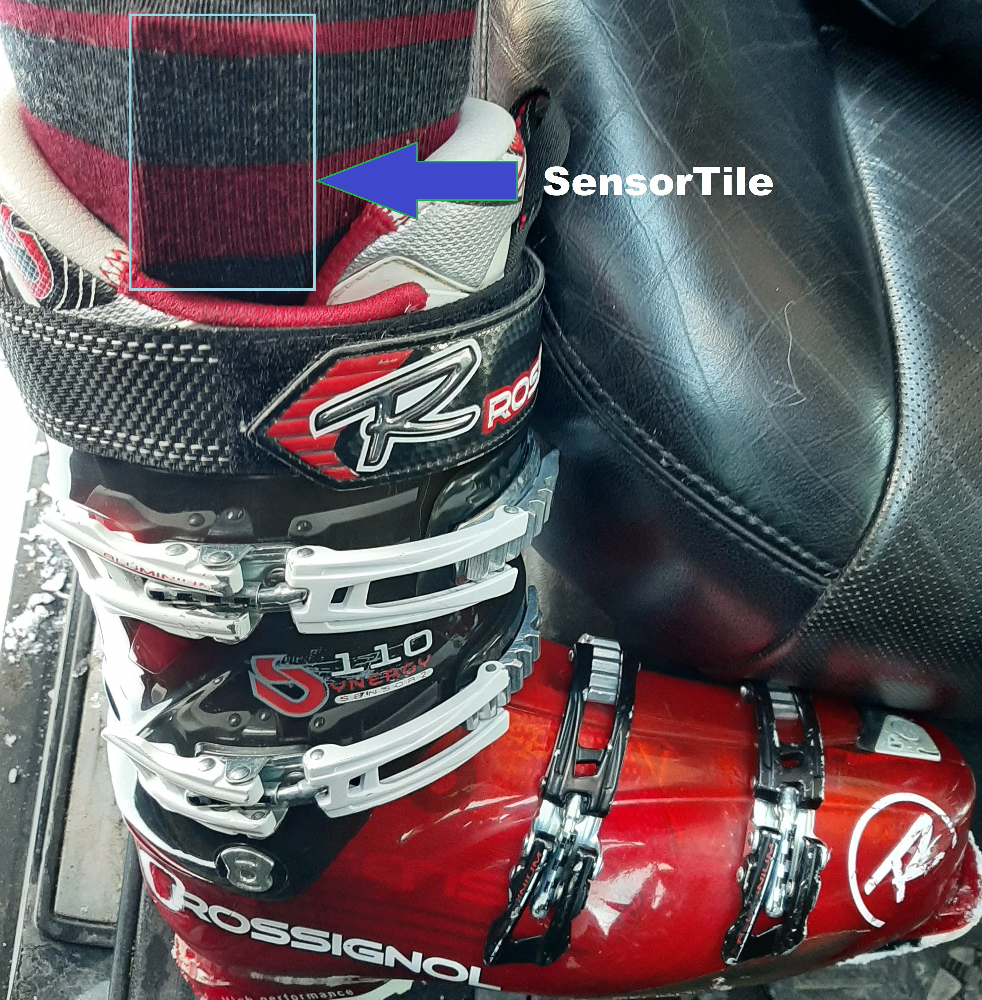
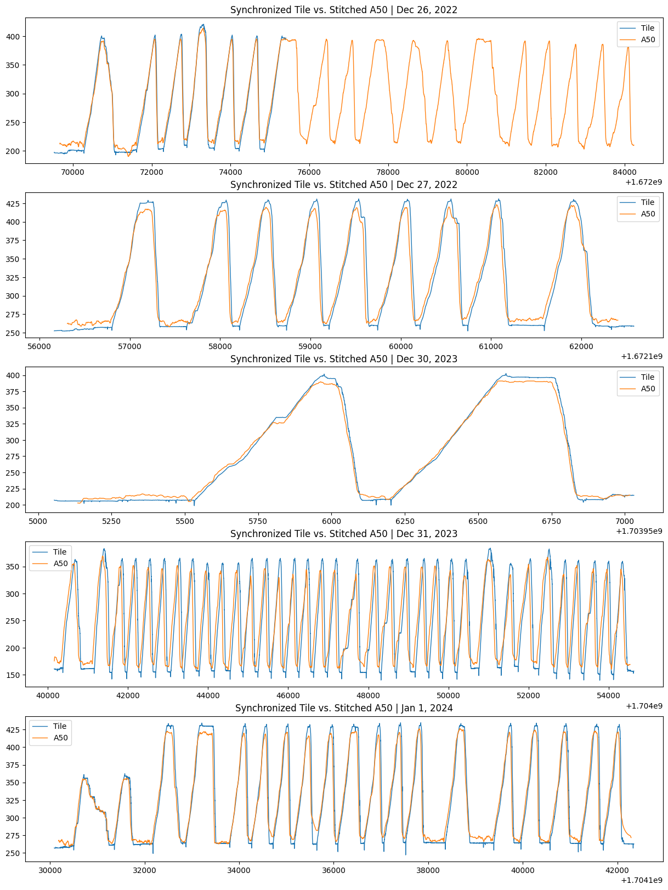
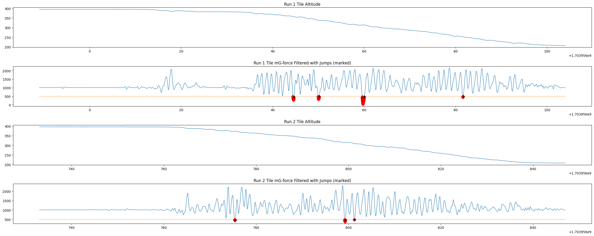
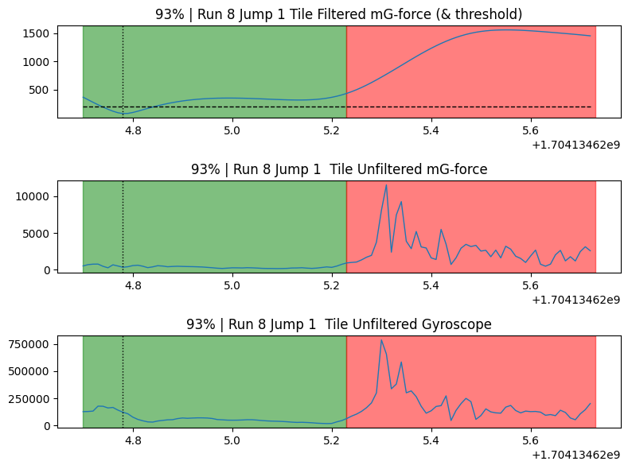
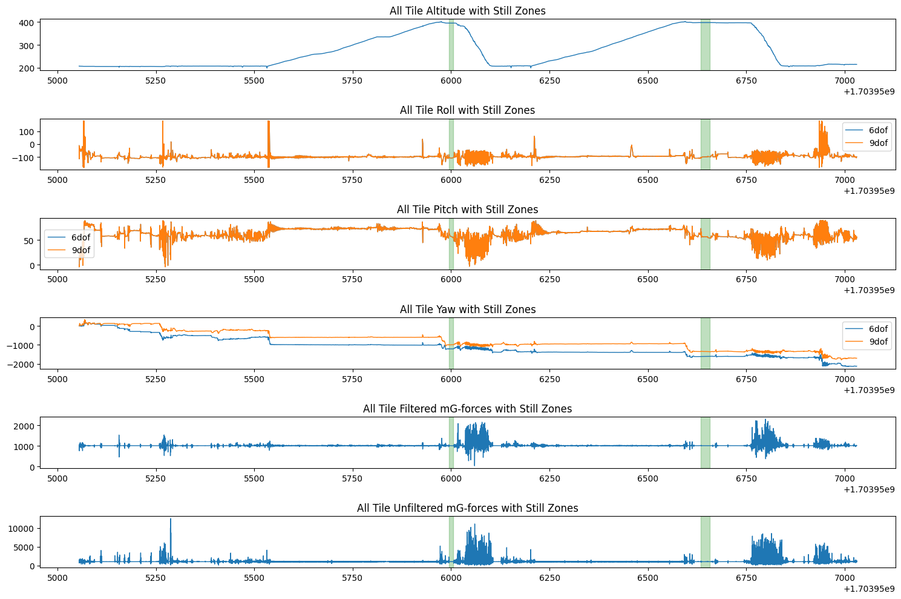
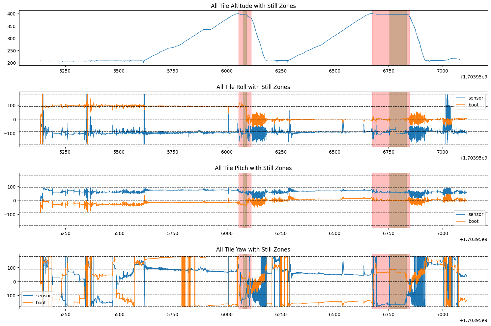

# Skiing Logging

## Goal

To provide more skiing analytics with an extra wearable placed above the ski boot, under the sock. Ideally, this device would publish data:

1. only during ski runs
2. to a parent device, such as an external activity tracker
3. for signals not available from the parent activity tracker

### Signals

- [x] altitude
- [x] g-force
- [x] jump count
- [x] jump distance
- [x] jump height
- [x] boot orientations
- [ ] turn count
  - [ ] left vs right
- [ ] ski carving angle
- [ ] ski angle of attack
- [ ] skid to carving ratio
- [ ] grf/reaction force power in [Watts]

Visit the individual notebooks for the explorations on identifying these signals. For much of these, a machine learning model could be trained to assign weighted parameters of the various statistical elements that define jumps and turns. This is currently being implemented by using the existing identification algorithms to generate data for labelling.

## Devices

Samsung A50 tracking with the SkiApp Pro, which captures complete tracking sets for all stages of a skiing activity. Includes track recognition and is split into 4 categories; downhill, lift, hold, & walk. Other data captured includes global timestamp (in s), 3d distance, 3d velocity, course/heading, altitude, latitude & longitude, and position accuracy (allegedly 2d from GPS). This device will be used as a ground truth to align the tile data through processed pressure data. This device was placed inside the jacket on the torso and had a sampling of 1Hz.



Garmin fenix 6 Pro tracked the activity and represents a more holistic/sport approach towards the track recognition. It only contains recorded data for the downhill portions of the ski activity and therefore won't be used to synchronize the tile data (through pressure/altitude alignment). The tracking itself contains many signals, including all of the A50 data & more. See the parsing notebook for more details. This device was worn on the left wrist and had a sampling of 1Hz.



STM32 SensorTile.Box tracked linear acceleration, angular velocity, magnetic field vectors, temperature, pressure, and humidity signals approximating the right ski. Timestamps are local and require synchronization (see notebook for more) to properly process with the ground truths. Pressure data is also raw and will require an offset to account for sensor differences, weather, etc. which are assumed to be constant for the entire activity. This device was worn tightly under the right sock above the right ski boot, facing laterally. All data signals were sampled at 100Hz



For many reasons, I've chose to gitignore the data for this remote.

## Data

Data was captured for 6 days of skiing, spread across 2 years and 4 hills/resorts, totalling ~100-150 runs.

- 0-6 jumps per run
- 30+ turns per run

### Parsing

General process was using notebooks as the background & testing, while finishing up with a function for reuse. Material covered here includes:

- [x] create a common track object containing common props between all devices
- [x] compare the ground truth files
- [x] parse individual data files for a50, f6p, & tile
- [x] synchronize the tile data with mapped global timestamps
  - [x] use the a50 ground truth here since an entire stitched dataset exists & will be more accurate
  - [x] confirm altitude on runs with garmin f6p ground truth
- [x] generate corrected altitude data for the tile mapped from ground truth
- [x] parse the tile data into tracks, focusing on the runs
  - [x] use the garmin timestamps to split since it's a more holistic activity-based approach, plus it's the parent signal you'll be pairing with in the end. Don't see a benefit in recognizing "Hold", "Walk", & "Lift" track types with the tile data. This doesn't work with the older F35 garmin ground truth, which didn't track altitude data.

After these steps, you'll have synchronized signals from each device, which are split into tracks for distinguishing the run data.

### Validation

Not much data crosses over between devices, however we can integrate the 3dof acceleration from the tile and compare it to the a50 & f6p velocities and possibly distance. Note that distance from the other devices is 3d and includes innacuracies in gps position and altitude (baro or mapped). Plus, many many other polynomials are neglected with this integration into velocity, friction, lift & drag, angular acceleration, etc. See the research-topics notebook for more.

- [x] internal integration method to calculate tile velocity (& distance maybe)

### SensorTile Algorithms

Since the estimations explored here will have no ground truths to compare with, this is all in the exploratory phase and will need further testing. Realtime (haptic?) feedback could be designed for the next stage which could provide results while the activity is tracking, ex: vibrate an external wearable on a recognized turn while going downhill.

Added features are aimed to be as low powered as possible, focus on obtaining results from:

- low sampling
- low processing, memory & cpu usage
- least amount of signals/hardware to include

But, for startes a full 6dof and 9dof orientation will be implemented- hopefully leading to correlations in raw signal patterns.

- [x] orientation algorithms for tile. Not aimed to be in the full wearable, so use a library.

## Notebook Results (at a glance)

See specific notebooks for more information and design process.

### Syncing Tile with A50

Since the Tile device wasn't timestamped globally, it required synchronization with the ground truths to properly align the time series signals. The altitude signals proved the best choice between the two, to generate an offset for the first timestamp. At the same time, to future proof I decided to export an altitude offset as well, since this is included in the A50 (GPS) and F6P (barometric) signals to account for weather and other relatively constant pressure effects.



The sync was a basic search of best fit in 2D using the altitude data. The lowest MAE/MSE between the entire session selected the optimal offsets. This took a while, but only needed to be run once since the architeture allowed for either:

- sending in an offset directly, that was previsouly run
- don't require sync so forget it (since it's mainly for research in notebooks)

### Jump Identification

G-force and gyroscopic signals proved to be decent for jump identification, given a low G threshold and some statistical tests for confirmation.



Listing these tests:

```python
return np.array([
    ST.testDecreasingTrend(mG_lpf, air_range),
    ST.testMinSampleCount(mG_lpf, air_range),
    ST.testMinSampleCount(mG_lpf, lowG_range, min_count=10),
    ST.testLowerSampleStdDev(mG, air_range),
    ST.testLowerSampleStdDev(gyro, air_range),
    ST.testLowerSampleMean(mG, air_range),
    ST.testLowerSampleStdDev(mG, air_range, landing_range),
    ST.testLowerSampleStdDev(gyro, air_range, landing_range),
    ST.testLowerSampleMean(mG, air_range, landing_range),
    ST.testLargerSampleStdDev(mG, landing_range),
    ST.testLargerSampleStdDev(gyro, landing_range),
    ST.testLargerSampleMean(mG, landing_range),
    ST.testLargerSampleMean(gyro, landing_range),
    ST.testLargeImpulse(mG, air_range),
    ST.testTimingOfLargeImpulse(mG, landing_range),
])
```

Singling out a single jump into the air time and landing phases used in those statistical tests:



In the future, these statistical tests could be assigned a weight parameter to better predict a jump. Developing these weight parameters would be done through labelled data in a neural net and is yet to be implemented. However, the application currently publishes all jumps with as many statistical features as possible into a datafile for future analysis.

### Frames | Sensor to Boot Orientation

To report usefull skiing analytics, the orientation signals need to be in the boot frame. Unfortunately, the sensor isn't rigidly mounted to the boot (or calf for that matter) so the registration is only an estimation. However, during a ski session, the liftpeak represents a repeatable point where the ski (and by extension, the ski since it's rigidly attached) and the sensor are motionless and flat. Other points during the session were considered, so see the notebook for more.

Identifying liftpeaks polled a large circular buffer for the altitude signals and reacted to points that began decreasing after a long period of increasing altitudes. This presents an assumption for a minimum lift period, where 3' was used. 

The exact point for capturing an average orientation was the moment the ski landed on the liftpeak platform (when the chair is still pushing you as you slide before you get off). This is a pretty flat surface, plus you're held in place for at least a few seconds- enough for a stillness detection. A search algorithm was designed to search for stillness based on std of orientation and G-force signals.



Using this registration allowed the rotation of the sensor frame into the boot frame. Since the important signals here are the 2D tilt angles, for carving and compression angles, heading wasn't corrected for since it'll be relative to a baseline later anyways. This allows for arbitrary placement of the sensor on the boot/calf as long as the FE planes match (for now) since rotation about the boot's x axis will always be consodered roll/carving angle.


